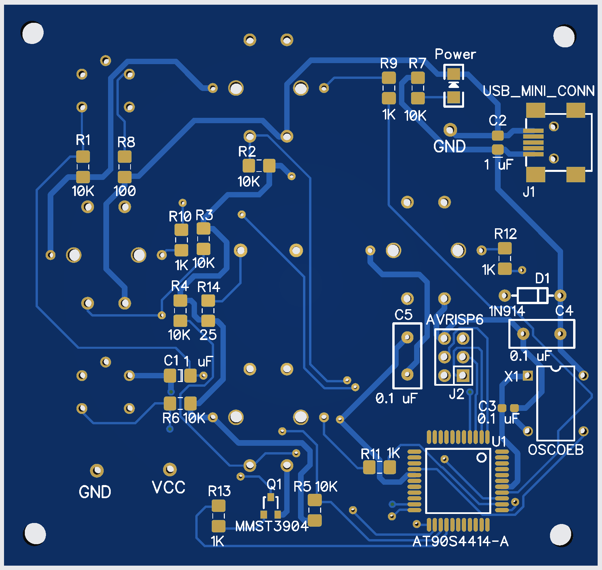
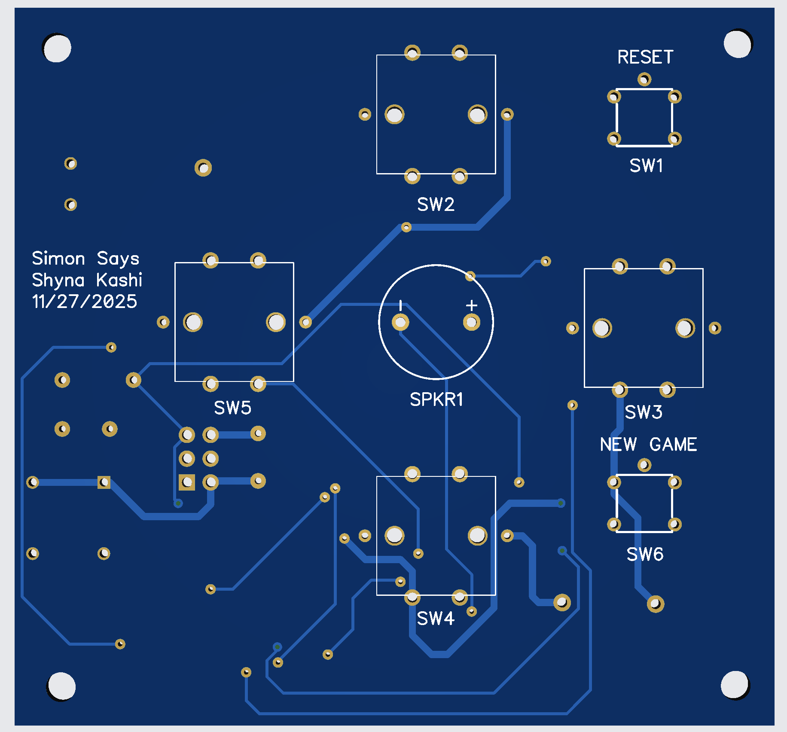

# Simon Says PCB

A custom printed circuit board for a Simon Says memory game, designed and assembled for Caltech EE 13 Electronic System Prototyping.

## Project Overview

This project covered the complete development of an electronic prototype, from schematic capture and printed circuit board design through physical assembly and debugging. I designed the circuit and two-layer PCB in DipTrace, generated the manufacturing files, soldered the fabricated board by hand, and tested the completed assembly.

The project gave me practical experience translating a circuit design into working hardware and diagnosing problems that appeared during assembly and bring-up.

## PCB Layout

| Component side | Switch side |
| --- | --- |
|  |  |

## Fully Functioning Project Demo

The following video shows the final soldered board operating as a complete Simon Says game with the code downloaded onto the microcontroller. Click the preview to watch the demo.

[](https://youtube.com/shorts/KQm7SFQvtsA?feature=share)

## My Work

- Created the circuit schematic in DipTrace
- Selected and placed the board components
- Routed the top and bottom copper layers
- Designed the board outline and silkscreen markings
- Prepared solder-mask, Gerber, and drill files for fabrication
- Hand-soldered the components onto the fabricated PCB
- Visually inspected component orientation and solder joints
- Used continuity testing to check electrical connections and identify unintended opens or shorts
- Troubleshot the assembled board and reworked solder joints or connections as needed
- Performed functional checks to confirm that the assembled system operated correctly

## Hardware

The Simon Says board includes:

- An embedded controller
- Four illuminated game switches
- Audio output
- Programming connectivity
- Supporting resistors, capacitors, and other components

## Design and Manufacturing Workflow

1. Captured the circuit schematic in DipTrace.
2. Assigned component footprints and arranged the physical board layout.
3. Routed the two copper layers and checked the completed layout.
4. Exported the copper, solder-mask, silkscreen, outline, and drill files.
5. Had the PCB fabricated and soldered the components onto the board.
6. Inspected the assembly and used a multimeter for continuity testing.
7. Debugged connection and soldering problems until the board passed its functional checks.

## Repository Structure

```text
simon-says-pcb/
|-- README.md
|-- images/
|   |-- pcb-layout-component-side.png
|   `-- pcb-layout-switch-side.png
`-- gerbers/
    |-- TopCopper.gbr
    |-- BottomCopper.gbr
    |-- TopMask.gbr
    |-- BottomMask.gbr
    |-- TopSilk.gbr
    |-- BottomSilk.gbr
    |-- BoardOutline.gbr
    |-- Plated_Through.drl
    `-- NonPlated_Through.drl
```

## Manufacturing Files

The `gerbers` directory contains the final fabrication outputs:

- Top and bottom copper layers
- Top and bottom solder masks
- Top and bottom silkscreens
- Board outline
- Plated and non-plated drill files

The files should be reviewed in a Gerber viewer before being submitted to a PCB manufacturer.

## Skills Demonstrated

- Electronic-system prototyping
- Schematic capture
- Printed circuit board design and routing
- Design-for-manufacturing preparation
- Through-hole and surface-mount soldering
- Multimeter and continuity testing
- Hardware bring-up and debugging
- Solder-joint inspection and rework

## Academic Context

This project was completed for EE 13 Electronic System Prototyping at the California Institute of Technology. The course covers schematic capture, PCB design, soldering, fabrication, and basic hardware debugging.

## Author

Shyna Kashi
